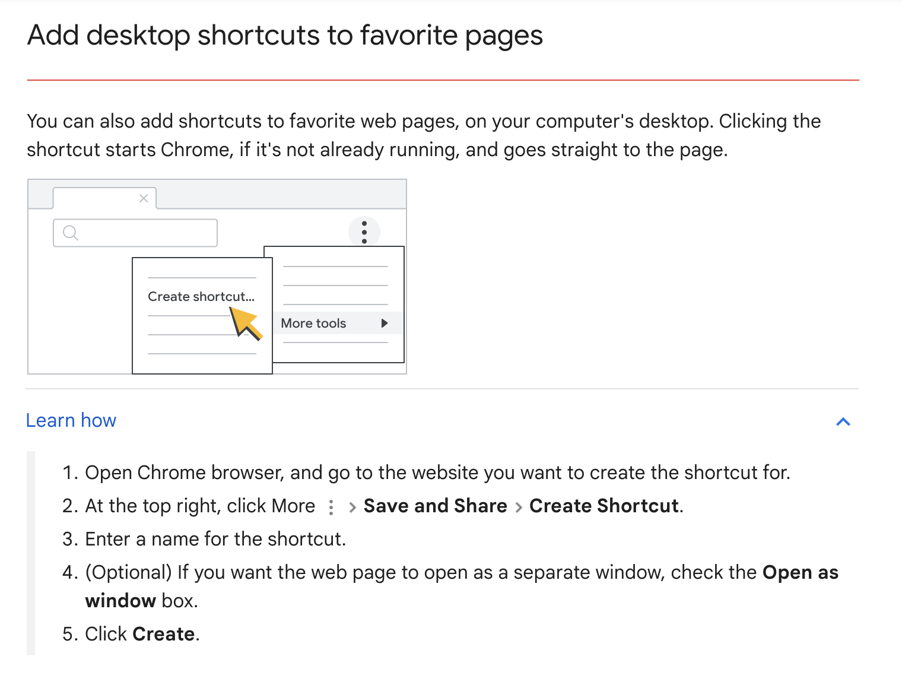

# Latex shortcuts chrome extension
This is a Chrome extension that allows you to write LaTeX more efficiently in the Notion web version. It enhances Notion's features by enabling LaTeX auto-completion, which is particularly useful for subjects like engineering, mathematics, and science.

To quote [Prof. Johnathan Manton](https://people.eng.unimelb.edu.au/jmanton/):
"...there are two key aspects to knowledge: snippets of information, and the relationships between these snippets...true knowledge lies [in the latter]."

Notion's flexible database structures help link ideas, but it lacks LaTeX auto-completion, which led to the creation of this project out of personal need.

**Shortcuts implemented:**
- Autocomplete `{}`, place cursor inside, allow typing `}` again once.

- Begin and end a LateX environment easily:
    `\beg` expands to `\begin{} \end{}` (any Notion block), 
    places cursor inside `\begin{}`, and as you type the environment name
    copies content from `\begin{envname}` -> `\end{envname}` include deletion (editing envname in \end does nothing)
    

<!-- | Description                                      | Trigger | Result                                                                                  | Example                         | Notion Block       |
|--------------------------------------------------|---------|-----------------------------------------------------------------------------------------|---------------------------------|--------------------|
| Begin and end a LaTeX environment easily         | `\beg`  | Expands to `\begin{} \end{}`, places cursor inside `\begin{}`, copies content to `\end{}`| `\beg` → `\begin{} \end{}`      | Inline Math         |
| Auto complete `{}`                               | `{`     | Expands to `{}`, places cursor inside                                                   | `{` → `{}`                      | Text Block         |
 -->

**Pending implementation:**
- [ ] fix feature 1
- include Gif to show the shortcuts and how much quicker?
- add suggestions & also options to add new shortcuts?
- figures 
- automate using documentation?
- add features as needed?
- visual drop down options?
- fix existing shortcuts
- add intellisense features (drop down options, actual suggestions as you type instead of just shortcuts)
- add little switch on/off feature? 
- fix the name of .js file 
- implement all the features from gilles castel
- implement all the features from overleaf
- publish on chrome extensions 
- make sure it only works in latex blocks in Notion-> not necessary because why would you type \x something if you don't want latex (notion uses / for its native shortcuts)


## Build
1. Build with webpack
```
yarn build
```

2. Load the [unpacked chrome extension](https://developer.chrome.com/docs/extensions/get-started/tutorial/hello-world#load-unpacked).


### How to add Notion as Chrome desktop shortcut (app-like experience with web version)
This Chrome extension only works in Chrome-based Notion, so I recommend to add Notion as a [desktop shortcut](https://support.google.com/a/users/answer/13293027?hl=en#desktop_shortcut&zippy=%2Clearn-how) to allow using Notion browser version in an app-like experience with the LaTeX shortcuts extension.


